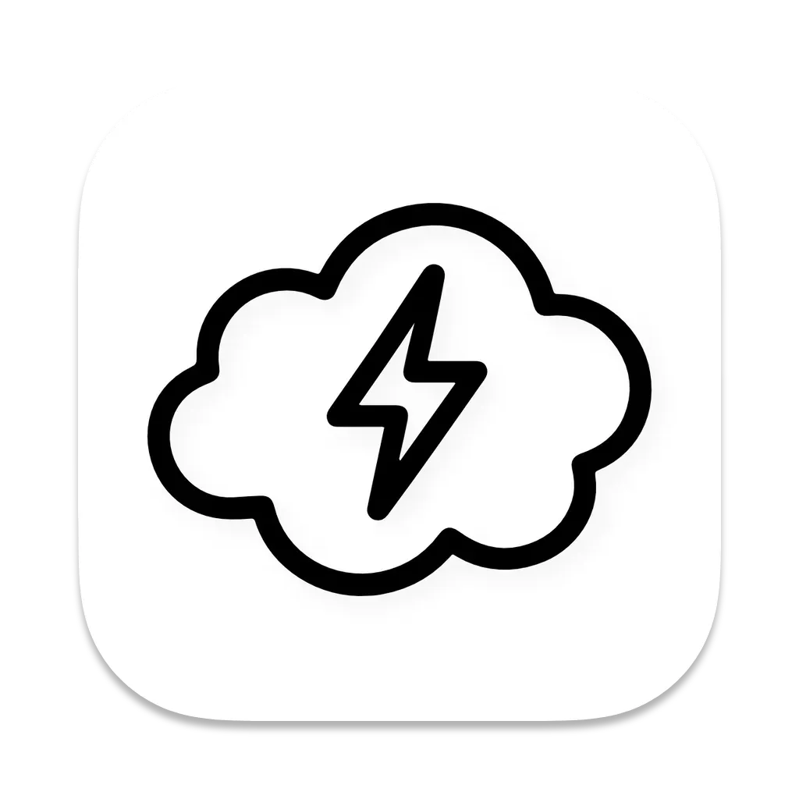

# SnapMind

<p align='center'>

</p>
<h1 align='center'>AI at the Speed of Thought</h1>
<p align="center">
  <a href="./README.md">English</a> | <a href="./README.zh.md">简体中文</a>
</p>
<p align="center">
  <a href="https://discord.gg/4bpEAKMUzw"></a>
  <a href="https://x.com/louisgh_7"></a>
  <a href="https://github.com/Snap-Mind/snap-mind/stargazers"></a>
  </br>
  <a href="./LICENSE"></a>
  <a href="https://github.com/Snap-Mind/snap-mind/releases"></a>
  <a href="https://github.com/conventional-branch/conventional-branch"></a>
  <a href="https://github.com/Snap-Mind/snap-mind/actions/workflows/build.yml"></a>
</p>

<p align="center">
  <a href="https://www.producthunt.com/products/snapmind?embed=true&utm_source=badge-featured&utm_medium=badge&utm_source=badge-snapmind" target="_blank"></a>
</p>

SnapMind is a desktop AI assistant that lets you **instantly interact with LLMs** from anywhere in your system. Select text + hit a hotkey, and get translations, rewrites, summaries, explanations, and more — all without switching apps, keeping your workflow smooth and uninterrupted.

---

## Features

- ⚡ **Blazing Fast** — Trigger AI with a single keystroke
- 🎯 **Seamless Experience** — Works in any app without breaking your flow
- 🛠 **Highly Customizable** — Set your own prompts for recurring tasks
- 🔌 **Multiple Providers** — See supported providers below

### Supported providers

<p align="center">
  
  &nbsp;&nbsp;
  
  &nbsp;&nbsp;
  
  &nbsp;&nbsp;
  
  &nbsp;&nbsp;
  
  &nbsp;&nbsp;
  
</p>

<p align="center"><sub>OpenAI · Anthropic · Azure OpenAI · Google Gemini · DeepSeek · Qwen</sub></p>

---

## Use Cases

- **Instant Translation** — Quickly translate selected text in any language
- **Polish & Rewrite** — Make text clearer, shorter, or more professional
- **Summarize in Seconds** — Turn long paragraphs or reports into key takeaways
- **Quick Explanations** — Highlight concepts, terms, or code for instant explanations
- **Smart Drafting** — Generate emails, replies, or text snippets quickly
- **Learning Companion** — Check grammar, simplify complex content, aid understanding
- **On-the-fly Brainstorming** — Transform notes or ideas into structured thoughts and action items

---

## Demo

<p align="center">
  
</p>

---

## Installation

### For Users

Download the latest installer from 👉 [snap-mind.github.io](https://snap-mind.github.io) or [Releases](https://github.com/Snap-Mind/snap-mind/releases).

> <u>Currently supports **macOS** and **Windows**.</u>

**On Windows**, you need to run this app with Administrator privileges (Run as Administrator).

**On MacOS**, after install the app

- You need to allow accessibility permissions, so the app can read your selected texts.
- You need to grant keychain access for the app to store your api keys.

### For Developers

Clone this repository:

```bash
git clone git@github.com:Snap-Mind/snap-mind.git
```

Install dependencies:

```
npm install
```

Build helper:

```
# on macOS:
npm run build:helper

# on Windows:
npm run build:win-helper
```

Start the dev server:

```
npm run dev:electron
```

Build on macOS:

```
npm run build:prod
```

Build on Windows:

```
npm run build:win-prod
```

## License

[Apache 2.0](./LICENSE)
